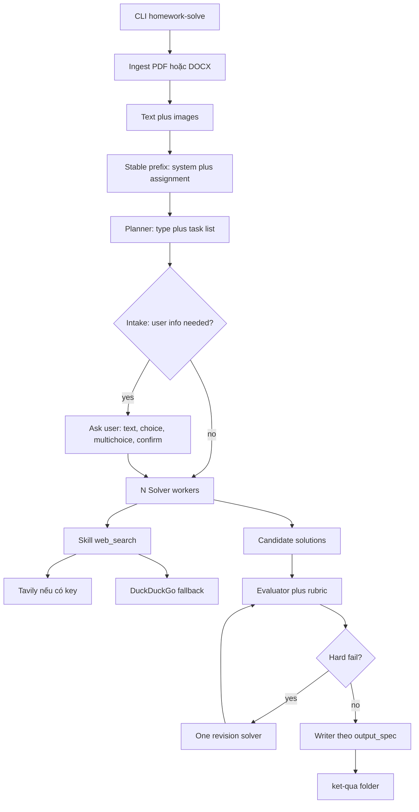

# Homework LLM Solver

CLI Python dùng LLM (OpenAI SDK, endpoint tùy chỉnh) để đọc đề bài PDF/DOCX (chữ + hình), phân rã việc, sinh nhiều đáp án, đánh giá rồi ghi kết quả tốt nhất.

## Cài đặt

Python 3.10+.

```bash
cd homework-llm-solver
python -m venv .venv
.venv\Scripts\activate
pip install -e .
copy .env.example .env
```

Sửa `.env`:

```
OPENAI_API_KEY=sk-...
OPENAI_BASE_URL=https://api.openai.com/v1
OPENAI_MODEL=gpt-4o
TAVILY_API_KEY=
```

- `OPENAI_BASE_URL` / `OPENAI_API_KEY` / `OPENAI_MODEL` theo chuẩn OpenAI Python SDK (`OpenAI(api_key=..., base_url=...)`).
- `TAVILY_API_KEY` tùy chọn. Có key thì search qua Tavily; không có thì fallback DuckDuckGo (`ddgs`).

## CLI

```bash
homework-solve path\to\de.pdf --out .\result --fast
homework-solve de.pdf --out .\ket-qua "Làm gọn tất cả bài thành 1 file tổng"
homework-solve de.docx --out .\out --workers 3 --no-web
homework-solve de.pdf --out .\ket-qua --fast
python -m homework_solver de.pdf --out .\ket-qua --max-search 4
```

Ngoài flags, có thể truyền thêm **một prompt phụ** ngay sau đường dẫn đề bài. Chuỗi này được gửi kèm cho planner, solver và evaluator như chỉ dẫn bổ sung (ví dụ gọn bài thành một file, đổi ngôn ngữ output, yêu cầu format riêng).

| Flag | Mặc định | Ý nghĩa |
|------|----------|---------|
| `extra_prompt` (positional) | không có | Prompt phụ gửi kèm planner/solver/evaluator |
| `--out` | `./ket-qua` | Thư mục kết quả |
| `--workers` | `3` | Số ứng viên solver mỗi task |
| `--no-web` | tắt | Không gọi skill `web_search` |
| `--max-search` | `4` | Số lần search tối đa mỗi worker |
| `--no-images` | tắt | Không gửi ảnh đã extract tới LLM |
| `--env-file` | `.env` hiện tại | File env khác |
| `--non-interactive` | tắt | Không hỏi thông tin người dùng; dùng giá trị mặc định |
| `--fast` | tắt | Chế độ nhanh: 1 worker, 2 lần search, solver/evaluator chỉ dùng text (giảm 3–5× token) |

Ứng dụng **không chạy** code do LLM sinh; chấm bằng LLM-as-judge.

## Cấu trúc thư mục

```text
homework-llm-solver/
  README.md
  .env.example
  .gitignore
  pyproject.toml
  src/homework_solver/
    cli.py                 # Typer CLI
    config.py              # Đọc OPENAI_* và TAVILY_API_KEY
    llm.py                 # OpenAI client, prefix cache, token log
    models.py              # Plan / Solution / Evaluation
    ingest/
      pdf.py               # PyMuPDF: text + ảnh; scan thì render trang
      docx.py              # python-docx: paragraph, table, ảnh
      normalize.py         # Nén/giới hạn ảnh
    pipeline/
      planner.py           # Phân loại và chia task
      intake.py            # Phân tích thông tin cần hỏi + thu thập từ người dùng
      solver.py            # N worker + tool web_search
      evaluator.py         # Chấm và chọn winner
      orchestrator.py      # Ghép luồng + 1 vòng sửa hard-fail
    skills/web_search.py   # Tavily rồi DuckDuckGo
    output/writer.py       # Ghi folder code / answers.md / essay.md
    prompts/               # Prompt tĩnh (system, planner, intake, solver, evaluator)
```

## Sơ đồ luồng



## Thông tin người dùng (user intake)

Sau khi planner đọc xong đề, một bước **intake** phân tích xem đề có yêu cầu thông tin chỉ người dùng mới có hay không — ví dụ mã số sinh viên cần ghi vào ảnh đầu ra, họ tên, hoặc các lựa chọn hướng làm bài. Nếu có, CLI hỏi tương tác:

- **text** — nhập tự do (có default, Enter để nhận default).
- **choice** — danh sách đánh số; gõ số hoặc id.
- **multichoice** — gõ nhiều số cách dấu phẩy, vd `1,3,4`.
- **confirm** — yes/no.

Giá trị trả về được chèn vào prompt của solver (để bài làm dùng đúng thông tin thật) và evaluator (judge trừ điểm nếu thiếu hoặc sai). Kết quả nằm trong `user_info.md` và `run_report.json` ở thư mục đầu ra.

Dùng `--non-interactive` để chạy không hỏi (batch/CI): mỗi field lấy giá trị `default`; field bắt buộc không có default sẽ ghi placeholder `<key>` và đánh dấu `filled_by: unfilled` trong report thay vì dừng pipeline.

Prompt phụ (positional) cũng được chèn vào prompt của solver và evaluator — judge sẽ chấm theo cả chỉ dẫn bổ sung này, nên yêu cầu như "gọn thành 1 file" được kiểm soát từ dòng lệnh.

**Chế độ `--fast`**: giữ nguyên chất lượng cho đề đơn giản nhưng giảm 3–5× token. Planner và intake vẫn nhận ảnh (cần vision để đọc đề), còn solver và evaluator chỉ nhận text — task instructions đã được planner tách sẵn nên không cần gửi lại toàn bộ đề. `--fast` ép `workers=1` và `max_search=2` (trừ khi bạn truyền giá trị nhỏ hơn).

Bước intake fail-soft: nếu LLM phân tích lỗi, hệ thống cảnh báo và tiếp tục chạy mà không có thông tin người dùng.

Ba vai trò LLM (planner, solver, evaluator) dùng **cùng prefix** để tận dụng prompt caching:

1. **Planner** — `code` | `mcq` | `essay` | `mixed`, danh sách task, `output_spec`.
2. **Solver** — mỗi task sinh N ứng viên; được tool `web_search` nếu planner bật `allow_web_search`.
3. **Evaluator** — chấm 0–10, chọn winner; nếu `hard_fail` thì một vòng sửa rồi chấm lại.

## Prompt caching (giảm chi phí)

- System prompt tĩnh trong `prompts/system.md` (không timestamp/UUID).
- User message đầu: toàn bộ đề (text + `image_url` data URI). Khối này **tái sử dụng** cho planner, mọi worker, evaluator.
- Chỉ các message sau (task, candidates, tool results) thay đổi.
- OpenAI và nhiều proxy tương thích cache prefix (~1024 token trở lên).
- Sau mỗi lần chạy, CLI in `prompt` / `cached` / `completion` tokens; chi tiết nằm trong `run_report.json`.

## Đầu ra

Tùy `output_spec` từ planner:

- **code / folder** — các file đúng path đề bài (ví dụ `src/main.py`).
- **mcq / answers** — `answers.md` dạng `1. A` kèm giải thích ngắn.
- **essay / markdown** — `essay.md`.
- **mixed** — kết hợp.

Luôn có:

- `run_report.json` — tasks, điểm, tokens, cache hits, search queries.
- `_source_images/` — ảnh extract từ đề (nếu có).

## Giới hạn

- File `.doc` cũ không hỗ trợ; hãy chuyển `.docx` hoặc `.pdf`.
- PDF scan: text có thể rỗng; hệ thống vẫn render trang thành ảnh và gửi LLM (trừ khi `--no-images`). OCR chuyên dụng không đi kèm.
- Model không hỗ trợ vision: pipeline thử lại text-only.
- Search web chỉ lấy snippet; không đăng nhập, không vượt paywall.
- Không sandbox-execute code sinh ra.
